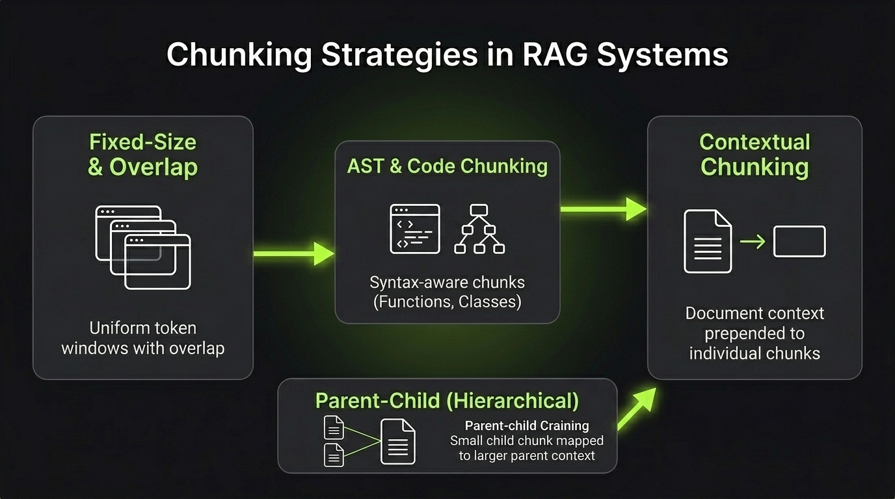

# Chunking Strategies

**Chunking** is the process of breaking large documents or codebases into smaller pieces before embedding and storing them.

Finding the right chunk size is a balance:
- **Too small**: Loses the surrounding context.
- **Too large**: Mixes too many topics together and makes search less accurate.

---

## 1. Basic & Structural Chunking

### Fixed-Size Chunking (with Overlap)
Splits text by a fixed token count with an overlap window to avoid cutting words or thoughts in half.
- *Best for:* Quick baseline setups.

### Structure-Aware & AST Chunking
Splits based on document structure (Markdown headings) or code syntax trees (**AST** with Tree-sitter for functions and classes).
- *Best for:* Technical documentation and code repositories.

---

## 2. Hierarchical Chunking

### Parent-Child (Small-to-Big)
Embeds small child chunks for precise vector matching, but returns the larger parent document to the LLM for rich context.
- *Best for:* High search accuracy without losing background details.

### Sentence Window
Embeds single sentences. When a sentence matches, it retrieves $k$ sentences before and after it.
- *Best for:* Finding specific facts inside long texts.

---

## 3. Modern SOTA Chunking

### Contextual Chunking
Before embedding, a small LLM adds a 1–2 sentence summary of the whole document to the top of each chunk. This removes ambiguity (e.g., clarifying which company or year a table belongs to).
- *Best for:* Enterprise documents with tables and cross-references.

### Late Chunking
Passes the entire document through a long-context embedding model first so every token sees the whole text. Then, it pools the embeddings into chunks.
- *Best for:* Preserving global document context inside individual chunk embeddings without extra LLM calls.

---



---

## Minimal Example (Contextual Chunking)

```python
# Contextual Chunking: prepending document context before embedding
doc_context = "Q3 2025 Financial Report for ACME Corp."
raw_chunk = "Operating revenue increased by 14% to $52M."

# The enriched chunk stored in the vector database
enriched_chunk = f"Context: {doc_context}\n\nContent: {raw_chunk}"
```

---

> **Small chunks are better for search accuracy; larger chunks and contextual enrichment are better for LLM reasoning.**

---

## References & Further Reading

- [Late Chunking: Contextual Chunk Embeddings Using Long-Context Embedding Models](https://arxiv.org/abs/2409.04701)
  - Introduces late chunking to preserve document-wide context across chunk embeddings without extra LLM calls.
- [Introducing Contextual Retrieval (Anthropic)](https://www.anthropic.com/news/contextual-retrieval)
  - Explains how prepending situational context to individual chunks significantly boosts retrieval accuracy.
- [Dense X Retrieval: What Retrieval Granularity Should We Use?](https://arxiv.org/abs/2312.06648)
  - Examines retrieval granularity and introduces proposition-based chunking for factual precision.
