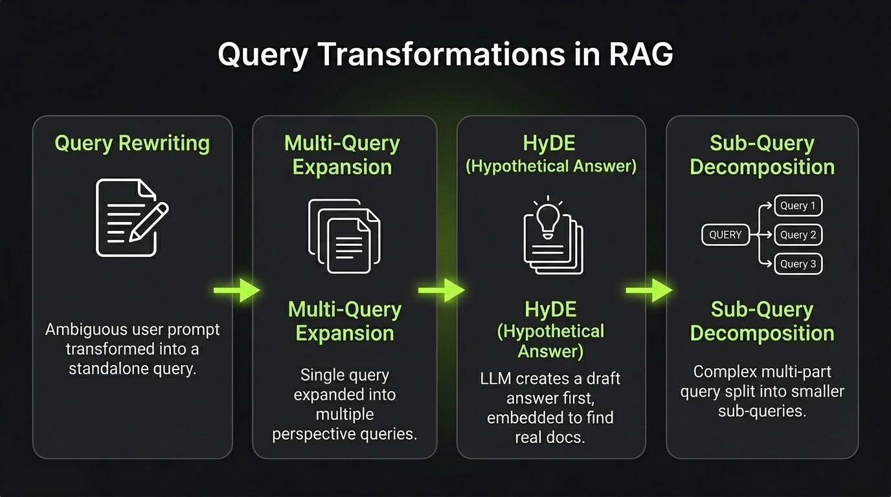

# Query Transformations

**Query Transformation** is the process of modifying, expanding, or rephrasing a user's question before sending it to the retrieval system.

Raw user queries are often ambiguous, too short, or missing critical context. Transforming the query bridges the gap between how humans ask questions and how search engines index documents.

`User Query ──► LLM Transformation ──► Optimized Search Query ──► Retrieval`

---

## Common Query Transformation Strategies

### 1. Query Rewriting (De-ambiguation)
Replaces vague conversational phrases or pronouns with clear, standalone keywords.
- *Example:* "What about its pricing?" ──► "Webito Pro Plan pricing and features"
- *Best for:* Multi-turn chats where context is lost between messages.

### 2. Multi-Query Expansion
Uses an LLM to generate 3–5 different variations of the query from different perspectives, searches for all of them, and combines the unique results.
- *Best for:* Overcoming phrasing differences between user terms and document vocabulary.

### 3. HyDE (Hypothetical Document Embeddings)
Instructs the LLM to write a hypothetical draft answer to the query first. The system then embeds this fake answer to find real documents with similar semantic meaning.
- *Best for:* Answering questions where questions and answers look semantically different.

### 4. Sub-Query Decomposition
Splits complex, multi-part questions into smaller, independent sub-questions that can be retrieved separately.
- *Example:* "Compare pricing of Tool A and Tool B" ──► Query 1: "Tool A pricing" + Query 2: "Tool B pricing".
- *Best for:* Multi-hop questions and comparison tasks.

---



---

## Minimal Example (HyDE)

```python
# 1. Generate a hypothetical answer
prompt = f"Write a short hypothetical paragraph answering: '{query}'"
hypothetical_answer = llm.generate(prompt)

# 2. Search vector database using the hypothetical answer's embedding
search_embedding = embedding_model.embed(hypothetical_answer)
chunks = vector_db.search_by_vector(search_embedding, top_k=3)
```

---

> **Users ask questions in natural conversation; search engines match answers. Query transformations bridge that gap.**

---

## References & Further Reading

- [Precise Zero-Shot Dense Retrieval without Relevance Labels (HyDE)](https://arxiv.org/abs/2212.10496)
  - Introduces the Hypothetical Document Embeddings (HyDE) technique to bridge the semantic gap in dense retrieval.
- [Take a Step Back: Evoking Reasoning via Abstraction in Large Language Models](https://arxiv.org/abs/2310.06167)
  - Demonstrates how abstracting queries into broader step-back questions improves retrieval and reasoning quality.
