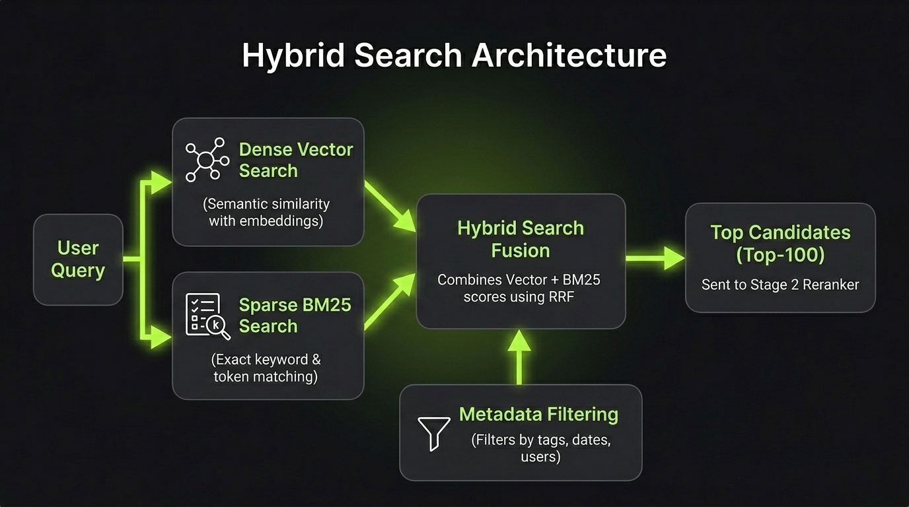

# Retrieval & Hybrid Search

**Retrieval** is the process of finding the most relevant chunks from a knowledge base to answer a user's query.

In real-world systems, relying solely on vector search often fails when users search for exact product IDs, error codes, or specific names. **Hybrid Search** solves this by combining semantic search with keyword search.

`Query ──► [ Dense Search + Sparse Search ] ──(Merge & Rank)──► Top Chunks`

---

## Search Paradigms

### 1. Dense Search (Vector Search)
Converts text into embeddings and searches by semantic similarity (e.g., Cosine Similarity).
- **Strengths:** Understands synonyms, general concepts, and meaning across different wordings.
- **Weaknesses:** Struggles with exact SKU numbers, variable names, error codes, and acronyms.

### 2. Sparse Search (BM25 / Keyword Search)
Matches exact words and scores documents based on term frequency and document rarity (TF-IDF / BM25).
- **Strengths:** Fast, reliable for exact matches, technical terms, and IDs.
- **Weaknesses:** Cannot understand synonyms (e.g., searching "car" misses "automobile").

### 3. Hybrid Search (Dense + Sparse)
Executes both Vector Search and BM25 simultaneously, then merges the ranked results using **Reciprocal Rank Fusion (RRF)** or weighted scoring.
- **Why it matters:** Gives the best of both worlds — conceptual understanding plus exact keyword precision.

### 4. Metadata Filtering & Self-Querying
Restricts the search space by pre-filtering chunks using structured tags (e.g., `user_id = 42`, `year >= 2025`, `category = "docs"`).
- *Best for:* Multi-tenant applications and multi-category knowledge bases.

---

## Two-Stage Retrieval Flow

In production RAG pipelines, retrieval acts as **Stage 1**:
- **Stage 1 (Retrieval - High Recall):** Fast search across millions of documents to return **Top 50–100 candidate chunks**.
- **Stage 2 (Reranking - High Precision):** Re-scores those candidates with a Cross-Encoder to pick the **Top 3–5 final chunks** (detailed in the next chapter).



---

## Minimal Example (Hybrid Search Scoring)

```python
def hybrid_score(dense_score: float, sparse_score: float, alpha: float = 0.6) -> float:
    """
    alpha = 1.0  -> Pure Vector Search (Dense)
    alpha = 0.0  -> Pure Keyword Search (BM25)
    alpha = 0.6  -> Balanced Hybrid Search (Recommended)
    """
    return (alpha * dense_score) + ((1 - alpha) * sparse_score)
```

---

> **Vector search finds the meaning; keyword search finds the exact match. Production RAG uses both.**

---

## References & Further Reading

- [The Probabilistic Relevance Framework: BM25 and Beyond](https://doi.org/10.1561/1500000019)
  - Comprehensive foundation and analysis of the classic BM25 ranking algorithm.
- [Reciprocal Rank Fusion Outperforms Condorcet and Individual Rank Learning Methods](https://doi.org/10.1145/1571941.1572114)
  - Introduces RRF, the standard algorithm used to merge rankings from multiple search systems.
- [Dense Passage Retrieval for Open-Domain Question Answering](https://arxiv.org/abs/2004.04906)
  - Foundational paper on using dense neural representations for information retrieval.
