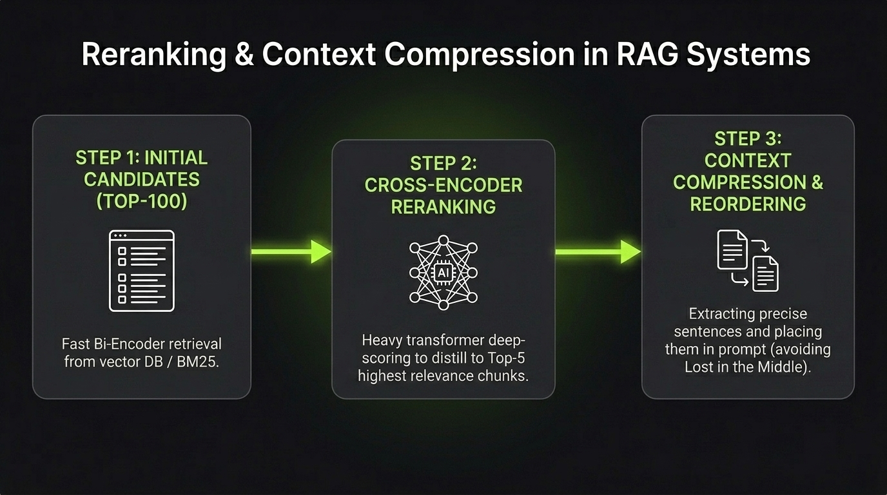

# Reranking & Compression

**Reranking and Compression** are post-retrieval techniques that filter, re-order, and clean retrieved chunks before sending them to the LLM.

Stage 1 retrieval is optimized for **speed and recall** (fetching ~100 candidate chunks). Reranking provides **precision** (distilling those 100 candidates down to the 3–5 most relevant chunks).

`Top-100 Candidates ──► Cross-Encoder Reranker ──► Top-5 Chunks ──► Context Compression ──► LLM`

---

## Bi-Encoders vs. Cross-Encoders

| Feature | Bi-Encoder (Vector Search) | Cross-Encoder (Reranker) |
|---|---|---|
| **Mechanism** | Encodes Query and Chunks separately | Feeds `[Query + Chunk]` together into the model |
| **Cross-Attention** | None (calculates simple cosine similarity) | Full cross-attention between every query and chunk token |
| **Speed** | Milliseconds over millions of chunks | Slower, best for 50–100 candidate chunks |
| **Accuracy** | Good for broad search | Exceptionally high precision |

---

## Post-Retrieval Techniques

### 1. Cross-Encoder Reranking
Passes the query and each candidate chunk together into a reranker model (such as Cohere Rerank or BGE-Reranker) to output a true relevance score from 0 to 1.
- *Best for:* Sorting the Top-100 candidates to extract the Top-3 to 5 chunks.

### 2. Contextual Compression & Pruning
Removes boilerplate text, irrelevant sentences, and formatting noise from the top chunks so only the answering sentences enter the prompt.
- *Best for:* Saving context window tokens and reducing cost.

### 3. Chunk Reordering (Avoiding "Lost in the Middle")
LLMs pay the most attention to information at the very beginning and very end of their context prompt. Re-ordering places the highest-scoring chunks at the top and bottom rather than buried in the middle.

---



---

## Minimal Example (Cross-Encoder Reranking)

```python
from sentence_transformers import CrossEncoder

# 1. Load a pre-trained reranker
reranker = CrossEncoder("BAAI/bge-reranker-large")

# 2. Score query against candidate chunks
candidates = ["Chunk A text...", "Chunk B text...", "Chunk C text..."]
pairs = [[query, doc] for doc in candidates]
scores = reranker.predict(pairs)

# 3. Pick top 3 highest scoring chunks
top_chunks = [doc for _, doc in sorted(zip(scores, candidates), reverse=True)[:3]]
```

---

> **Retrieval finds what might be relevant; Reranking guarantees what is actually relevant.**

---

## References & Further Reading

- [Lost in the Middle: How Language Models Use Long Contexts](https://arxiv.org/abs/2307.03172)
  - Seminal paper analyzing how LLM attention degrades for information placed in the middle of long prompts.
- [ColBERT: Efficient and Effective Passage Search via Contextualized Late Interaction over BERT](https://arxiv.org/abs/2004.12832)
  - Introduces late interaction token-level scoring for fast, high-accuracy ranking.
