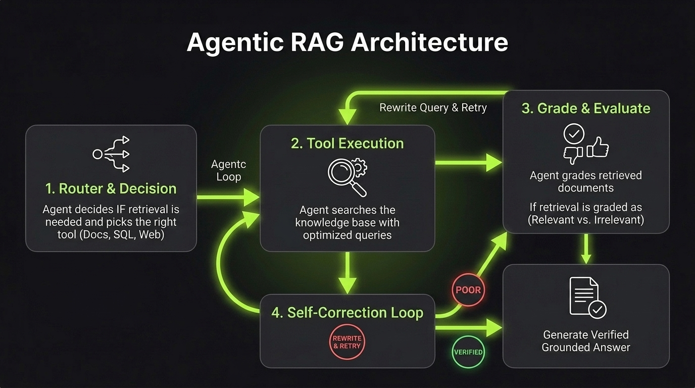

# Agentic RAG

**Agentic RAG** is an autonomous approach where an AI agent dynamically decides **when**, **where**, and **how** to retrieve knowledge, and evaluates whether the retrieved information is good enough to answer the question.

In traditional RAG, retrieval is a static one-way pipeline (`Retrieve ──► Generate`). In Agentic RAG, retrieval is an active **tool** inside a reasoning loop.

`Agent Decision ──► Call Search Tool ──► Evaluate Results ──► Iterate or Answer`

---

## Core Agentic RAG Patterns

### 1. Router Pattern (Dynamic Source Selection)
The agent analyzes the user's intent to decide whether retrieval is necessary, and routes the query to the best source:
- *General conversation* ──► Direct LLM response (No retrieval needed).
- *Product documentation* ──► Vector Database / Hybrid Search.
- *Structured stats & revenue* ──► SQL Database tool.
- *Breaking recent news* ──► Web Search API.

### 2. Corrective RAG (CRAG)
After retrieving chunks, the agent **grades the relevance** of the documents:
- **Relevant:** Chunks are passed to generate the answer.
- **Ambiguous or Poor:** The agent rewrites the query or falls back to an alternative source (e.g., Web Search).

### 3. Self-RAG & Hallucination Checking
The agent reviews its own generated answer against the retrieved evidence to ensure every claim is grounded in the source documents before responding to the user.

### 4. Multi-Hop Retrieval
For complex questions requiring information from multiple places, the agent breaks the problem down and performs sequential searches:
- *Step 1:* "Who is the CEO of Company X?" ──► Retrieves name.
- *Step 2:* "What university did [CEO Name] attend?" ──► Retrieves university.

---



---

## Minimal Example (Agent Evaluation & Retry)

```python
# 1. Agent calls retrieval tool
chunks = search_knowledge_base(query)

# 2. Agent grades the retrieved context
is_relevant = grade_documents(query, chunks)

if not is_relevant:
    # 3. Self-Correction: rewrite query and retry
    better_query = rewrite_query(query)
    chunks = search_knowledge_base(better_query)

# 4. Generate grounded answer
response = generate_answer(query, chunks)
```

---

> **Traditional RAG assumes the first search is always perfect; Agentic RAG evaluates, adapts, and self-corrects.**

---

## References & Further Reading

- [Self-RAG: Learning to Retrieve, Generate, and Critique through Self-Reflection](https://arxiv.org/abs/2310.11511)
  - Foundational paper introducing self-reflection tokens for adaptive retrieval and hallucination checking.
- [Corrective Retrieval Augmented Generation (CRAG)](https://arxiv.org/abs/2401.15884)
  - Proposes document grading and web fallback mechanisms to correct poor retrieval results.
- [Adaptive-RAG: Learning to Adapt Retrieval-Augmented LLMs through Question Complexity](https://arxiv.org/abs/2403.14403)
  - Explores dynamic routing between direct answering, single-step RAG, and multi-step agentic retrieval.
